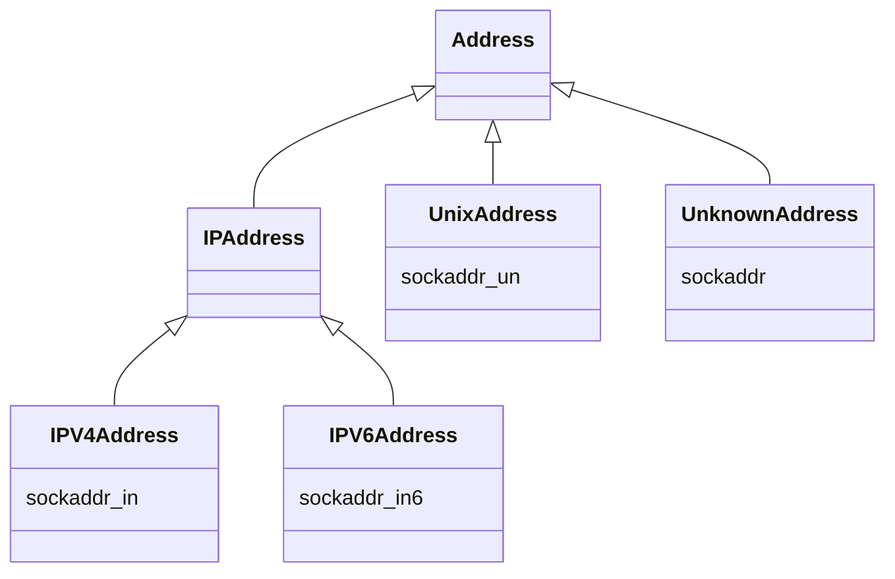

## 网络地址模块

`socket` 的通信都需要与地址打交道，所以封装了 `Address` 模块，不用直接使用繁琐的C接口。

### TODO

- [ ] Qt和小彭老师的“建造器”模式

### Berkeley套接字接口的地址

几乎所有的（Berkeley）套接字接口都需要传入一个地址参数（比如在`connect`或`send`时指定对端的地址），用于表示网络中的一台主机的通信地址。不同的协议类型对应的地址类型不一样，比如IPv4协议对应IPv4地址，长度是32位，而IPv6协议对应IPv6地址，长度是128位，又比如Unix域套接字地址是一个路径字符串。

如果针对每种类型的地址都制定一套对应的API接口，那么最终的套接字API接口数量规模一定会非常宠大，这对开发和维护都没好处。我们希望的是只使用一套通用的API接口就能实现各种地址类型的操作，比如针对IPv4地址的代码，能够在不修改或尽量少修改的前提下，就可用于IPv6地址。对此，Berkeley套接字接口拟定了一个通用套接字地址结构`sockaddr`，用于表示任意类型的地址，所有的套接字API在传入地址参数时都只需要传入`sockaddr`类型，以保证接口的通用性。除通用地址结构`sockaddr`外，还有一系列表示具体的网络地址的结构，这些具体的网络地址结构用于用户赋值，但在使用时，都要转化成`sockaddr`的形式。

`sockaddr`表示通用套接字地址结构，其定义如下：

```c
struct sockaddr
{
    unsigned short sa_family; // 地址族，也就是地址类型
    char sa_data[14];         // 地址内容
};
```

**所有的套接字API都是以指针形式接收sockaddr参数**，并且额外需要一个地址长度参数，这可以保证当`sockaddr`本身不足以容纳一个具体的地址时，可以通过指针取到全部的内容。比如上面的地址内容占14字节，这并不足以容纳一个128位16字节的IPv6地址。但当以指针形式传入时，完全可以通过指针取到适合IPv6的长度。

除`sockaddr`外，套接字接口还定义了一系列具体的网络地址结构，比如`sockaddr_in`表示IPv4地址，`sockaddr_in6`表示IPv6地址，`sockaddr_un`表示Unix域套接字地址，它们的定义如下：

```c
struct sockaddr_in
{
    unsigned short sin_family; // 地址族，IPv4的地址族为AF_INET
    unsigned short sin_port;   // 端口
    struct in_addr sin_addr;   // IP地址，IPv4的地址用一个32位整数来表示
    char sin_zero[8];          // 填充位，填零即可
};
 
struct sockaddr_in6
{
    unsigned short sin6_family; // 地址族，IPv6的地址族为AF_INET6
    in_port_t sin6_port;        // 端口
    uint32_t sin6_flowinfo;     // IPv6流控信息
    struct in6_addr sin6_addr;  // IPv6地址，实际为一个128位的结构体
    uint32_t sin6_scope_id;     // IPv6 scope-id
};
 
struct sockaddr_un
{
    unsigned short sun_family;  // 地址族，Unix域套字地址族为AF_UNIX
    char sun_path[108];         // 路径字符串
};
```

通过上面的定义也可以发现，除`sockaddr_in`可以无缝转换为`sockaddr`外，`sockaddr_in6`和`sockaddr_un`都不能转换为`sockaddr`，因为大小不一样。但这并不影响套接字接口的通用性，因为在使用时，**所有类型的地址都会转换成`sockaddr`指针**，又由于以上**所有的地址结构的前两个字节都表示地址族**，所以通过`sockaddr`指针总能拿到传入地址的地址类型，通过地址类型判断出地址长度后，**再通过`sockaddr`指针取适合该地址的长度即可拿到地址内容**。

实际使用时，一般都是先定义具体的网络地址结构并初始化，然后在传入套接字接口时，通过指针强制转化成`sockaddr`类型，例如为TCP套接字绑定IPv6地址：

```c
int sockfd;
sockaddr_in6 addr; // 具体的地址类型
 
sockfd = socket(AF_INET6, SOCK_STREAM, 0);
 
memset(&addr, 0, sizeof(sockaddr_in6));
addr.sa_family = AF_INET6;
addr.sin6_addr.s_addr = in6addr_any;
addr.sin6_port = htons(80);
// 通用的地址类型指针+长度
bind(sockfd, (sockaddr*)&addr, sizeof(addr)); // 这里将IPv6地址也转化成sockaddr*再传入bind
                                              // 虽然sockaddr结构体并不足以容纳一个IPv6地址，但是传入的是指针和地址长度，
                                              // bind内部在判断出当前地址是IPv6地址的情况下，
                                              // 仍然可以通过指针和长度取到一个完整的IPv6地址
```

### 字节序

- 大端模式：高位低地址，低位高地址。优势是：**符号位固定为第一个字节，容易判断正负**
- 小端模式：高位高地址，低位低地址。优势是：**强制转换数据不需要调整原字节内容，只需高地址添0**

假设有一个十六制数：0x12345678

| 内存地址 | 小端模式存放内容 | 大端模式存放内容 |
| :------: | :--------------: | :--------------: |
|  0x4000  |       0x78       |       0x12       |
|  0x4001  |       0x56       |       0x34       |
|  0x4002  |       0x34       |       0x56       |
|  0x4003  |       0x12       |       0x78       |

#### 判断大小端

- 可以利用 `union` 联合体
- 可以利用 `endian.h` 的 `BYTE_ORDER` 来判断。`LITTLE_ENDIAN` 为小端，`BIG_ENDIAN` 为大端

网络字节序默认是大端，主机字节序默认是小端。

#### 大小端模式的转换

`byteswap.h`：

- `bswap_16()`：将一个 16 位整数从大端字节序转换为小端字节序或从小端字节序转换为大端字节序。
- `bswap_32()`：将一个 32 位整数从大端字节序转换为小端字节序或从小端字节序转换为大端字节序。
- `bswap_64()`：将一个 64 位整数从大端字节序转换为小端字节序或从小端字节序转换为大端字节序。

`arpa/inet.h`：

- `htonl()`：将一个 `unsigned long` 从主机字节序转化为网络字节序
- `htons()`：将一个 `unsigned short` 从主机字节序转化为网络字节序
- `ntohl()`：将一个 `unsigned long` 从网路字节序转化为主机字节序

- `ntohs()`：将一个 `unsigned short` 从网络字节序转化为主机字节序

### 代码实现

提供网络地址相关的类，支持与网络地址相关的操作，一共有以下几个类：

- `Address`：所有网络地址的基类，抽象类，对应`sockaddr`类型，但只包含抽象方法，不包含具体的成员。除此外，`Address`作为地址类还提供了网络地址查询及网卡地址查询功能。
- `IPAddress`：IP地址的基类，抽象类，在`Address`基础上，增加了IP地址相关的端口以及子网掩码、广播地址、网段地址操作，同样是只包含抽象方法，不包含具体的成员。
- `IPv4Address`：IPv4地址类，实体类，表示一个IPv4地址，对应`sockaddr_in`类型，包含一个`sockaddr_in`成员，可以操作该成员的网络地址和端口，以及获取子码掩码等操作。
- `IPv6Address`：IPv6地址类，实体类，表示一个IPv6地址，对应`sockaddr_in6`类型，包含一个`sockaddr_in6`成员。
- `UnixAddreess`：Unix域套接字类，对应`sockaddr_un`类型，同上。
- `UnknownAddress`：表示一个未知类型的套接字地址，实体类， 对应`sockaddr`类型，这个类型与`Address`类型的区别是它包含一个`sockaddr`成员，并且是一个实体类。

